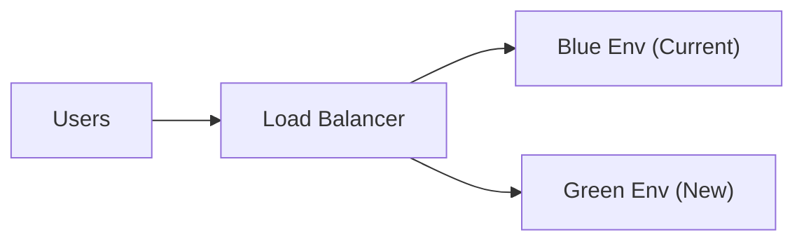
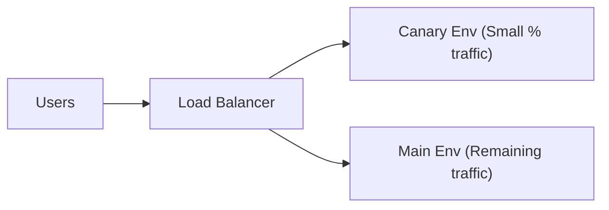
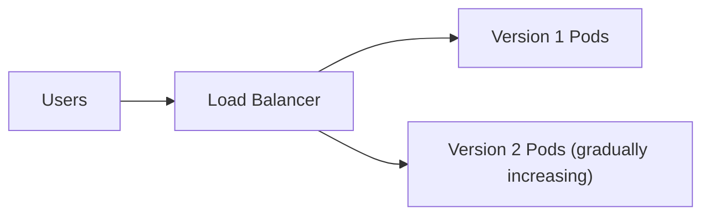

# CI/CD Practical Guide

## Why CI/CD?
- **Continuous Integration and Continuous Delivery (CI/CD)** are modern software engineering practices that ensure every code change is tested, integrated, and deployed quickly and safely.

- **CI (Continuous Integration)**: Detect bugs early by automatically building and testing on every commit.

- **CD (Continuous Delivery/Deployment)**: Deploy stable code to production or staging environments with minimal manual intervention.

- **Value**: CI/CD reduces manual effort, prevents integration issues, increases developer productivity, and enables faster, more reliable releases.

---

## Key Concepts
- **Continuous Integration (CI):** Automates builds, runs tests, and integrates code changes frequently to catch issues early.  
- **Continuous Delivery (CD):** Keep code in a deployable state at all times; releases are a business decision.  
- **Continuous Deployment:** Fully automate production deployments once all checks pass.  
- **Pipelines as Code:** Define workflows (build → test → deploy) in version control using tools like GitHub Actions, GitLab CI, or Jenkins.


## Minimum Viable Pipeline (GitHub Actions, Python)

```yaml
name: CI Pipeline
on:
  push:
    branches: [ "main" ]
  pull_request:

jobs:
  ci:
    runs-on: ubuntu-latest
    steps:
      - uses: actions/checkout@v4
      - uses: actions/setup-python@v5
        with:
          python-version: "3.11"
      - name: Install deps
        run: |
          python -m pip install --upgrade pip
          pip install -r requirements.txt || true
          pip install black flake8 pytest bandit pip-audit
      - name: Format (Black) – check only
        run: black --check .
      - name: Lint (Flake8)
        run: flake8 .
      - name: Unit tests (Pytest)
        run: pytest -q
      - name: Security – Bandit (code)
        run: bandit -r .
      - name: Security – pip-audit (deps)
        run: pip-audit
```

---

## Best Practices for CI/CD

- **Fail Fast**: Keep pipelines short and provide quick feedback.

- **Automated Testing**: Cover unit, integration, performance, and security tests.

- **Secrets Management**: Use GitHub Secrets, Vault, or cloud key stores — never hardcode passwords.

- **Promote Environments**: Always test in staging before production.

- **Monitoring & Alerts**: Track build duration, test coverage, and pipeline success rates.

---

## Common Pitfalls & How to Avoid Them

| Pitfall                   | Problem                 | Solution                                        |
| ------------------------- | ----------------------- | ----------------------------------------------- |
| Long builds               | Wastes developer time   | Use caching & parallel jobs                     |
| Skipping infra validation | Broken deployments      | Validate IaC (`terraform validate`, `cfn-lint`) |
| Hardcoding secrets        | Security risks          | Store secrets in encrypted vaults               |
| No rollback strategy      | Production downtime     | Use blue/green or canary deployments            |
| Ignoring test automation  | More bugs in production | Automate tests early in the pipeline            |

---

## Advanced CI/CD Enhancements

- **Caching & Artifacts**: Speed up builds by caching Docker layers, pip/npm packages, or reusing artifacts.

- **Matrix Builds**: Test across multiple OS (Linux, Windows, Mac) or Python/Node versions.

- **Notifications**: Send alerts to Slack/Teams on success/failure.

- **Security Integration**: Run SAST/DAST tools (e.g., Trivy, SonarQube, Bandit, Snyk).

- **Infrastructure as Code (IaC)**: Deploy infra automatically using Terraform, CloudFormation, or Ansible.

- **Progressive Delivery**: Use feature flags, canary deployments, and blue/green releases for safer rollouts.

---

**Blue/Green Deployment**

- **Two environments**: Blue (current) & Green (new).

- Traffic is switched from Blue → Green once tests pass.

- **Benefit**: Zero-downtime deployments, quick rollback.



---

**Canary Deployment**

- **Gradual rollout**: A small % of traffic goes to the new version (Canary).

- Monitor performance & errors before full release.

- **Benefit**: Reduces risk of bad deployments.



---

**Rolling Deployment**

- **Step-by-step upgrade**: Replace old version pods (V1) with new ones (V2) gradually.

- No need for two full environments.

- **Benefit**: Smooth upgrades with controlled rollout speed.



---

## 🔧 CI/CD Tools – Guide

**1. GitHub Actions**

- **What it is**: A CI/CD automation platform built directly into GitHub. You define workflows using YAML files inside .github/workflows.

- **Why it is used**: It’s beginner-friendly, tightly integrated with GitHub, and has a huge marketplace of ready-to-use actions (deployments, testing, linting, etc.). No external CI server needed.

- **When to use it**: Perfect for developers and open-source projects already on GitHub. Teams benefit from seamless pull request checks, quick deployments, and low setup time.

- **Extra Insight**: GitHub Actions is becoming the **de facto standard for modern CI/CD in open-source** because of its simplicity and community support.

**2. GitLab CI/CD**

- **What it is**: Part of GitLab’s “all-in-one” DevOps platform, combining version control, CI/CD pipelines, container registry, and monitoring.

- **Why it is used**: Reduces the need for multiple tools (e.g., no need for a separate Docker registry or third-party security scanners). It’s very popular in enterprises.

- **When to use it**: Best for teams that want an end-to-end DevOps solution with one platform to manage code, pipelines, and security.

- **Extra Insight**: GitLab CI/CD is often chosen by regulated industries (finance, healthcare) due to its strong security scanning features.

**3. Jenkins**

- **What it is**: The most widely used open-source automation server for CI/CD, around since 2011.

- **Why it is used**: Extremely flexible — it supports thousands of plugins and integrates with virtually every tool in the software ecosystem.

- **When to use it**: Best for large enterprises or organizations needing customized, on-premise CI/CD pipelines.

- **Extra Insight**: Jenkins is powerful but requires maintenance and DevOps expertise. Many companies still rely on it because of its maturity and massive ecosystem.

**4. Azure DevOps Pipelines**

- **What it is**: Microsoft’s CI/CD platform within the broader Azure DevOps suite.

- **Why it is used**: Supports Windows, Linux, macOS builds, and integrates tightly with Azure services. Includes features like package feeds, test management, and dashboards.

- **When to use it**: Best for organizations already invested in Microsoft technologies (.NET, SQL Server, Azure Cloud).

- **Extra Insight**: Azure Pipelines can also be used with GitHub and other repos, not just Azure — making it flexible beyond Microsoft’s ecosystem.

**5. AWS CodePipeline**

- **What it is**: A managed CI/CD service on AWS that automates code build, test, and deployment.

- **Why it is used**: Natively integrates with AWS services like CodeBuild, CodeDeploy, S3, ECS, and Lambda.

- **When to use it**: Perfect for teams already running workloads on AWS Cloud.

- **Extra Insight**: Since it’s AWS-native, companies often choose CodePipeline to reduce third-party dependencies and simplify cloud-native deployments.

**6. Google Cloud Build**

- **What it is**: A serverless CI/CD service from Google Cloud that builds, tests, and deploys apps directly in GCP.

- **Why it is used**: Supports Docker images, Kubernetes (GKE), Cloud Run, and App Engine. Scales automatically without infrastructure management.

- **When to use it**: Ideal for organizations already leveraging Google Cloud Platform.

- **Extra Insight**: Popular in AI/ML startups running on GCP because of tight integration with TensorFlow, BigQuery, and ML pipelines.

**7. ArgoCD (GitOps)**

- **What it is**: A Kubernetes-native continuous delivery tool based on GitOps principles.

- **Why it is used**: Ensures that Kubernetes clusters always match the desired state defined in Git.

- **When to use it**: Best for microservices and containerized workloads running on Kubernetes.

- **Extra Insight**: ArgoCD has become the standard for GitOps in Kubernetes — widely used in modern cloud-native companies.

**8. Spinnaker**

- **What it is**: An open-source, multi-cloud continuous delivery platform originally developed by Netflix.

- **Why it is used**: Supports advanced deployment strategies (blue/green, canary) and multi-cloud pipelines across AWS, GCP, Azure, and Kubernetes.

- **When to use it**: Large enterprises with multi-cloud or hybrid cloud strategies.

- **Extra Insight**: Spinnaker is trusted by companies like Netflix and Google because of its reliability at internet-scale deployments.

**9. Tekton**

- **What it is**: A Kubernetes-native CI/CD framework maintained by the CNCF (Cloud Native Computing Foundation).

- **Why it is used**: Provides reusable “pipeline building blocks” for creating cloud-native CI/CD systems. It’s used as the foundation for OpenShift Pipelines.

- **When to use it**: Ideal for cloud-native teams building custom pipelines inside Kubernetes.

- **Extra Insight**: Tekton is modular and extensible — rather than being a full CI/CD platform, it lets teams build their own tailored pipelines.

## Final Takeaway

CI/CD is not just about automation — it’s about **delivering value faster and safer**.

- Developers → get faster feedback.

- Businesses → release features with confidence.

- Customers → enjoy reliable updates without downtime.

By following best practices and avoiding common pitfalls, teams can build a **scalable, secure, and professional CI/CD pipeline** that works for both small projects and enterprise systems.
